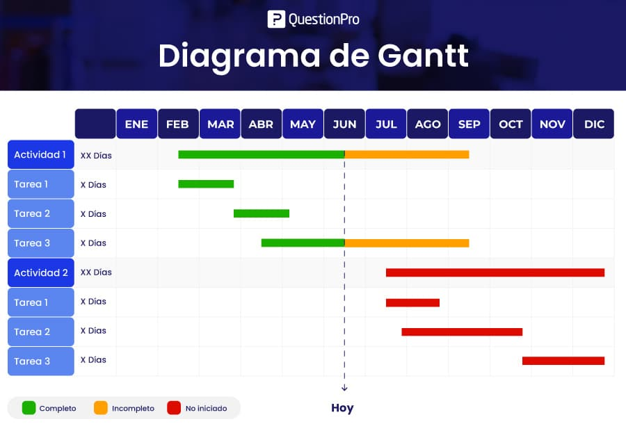
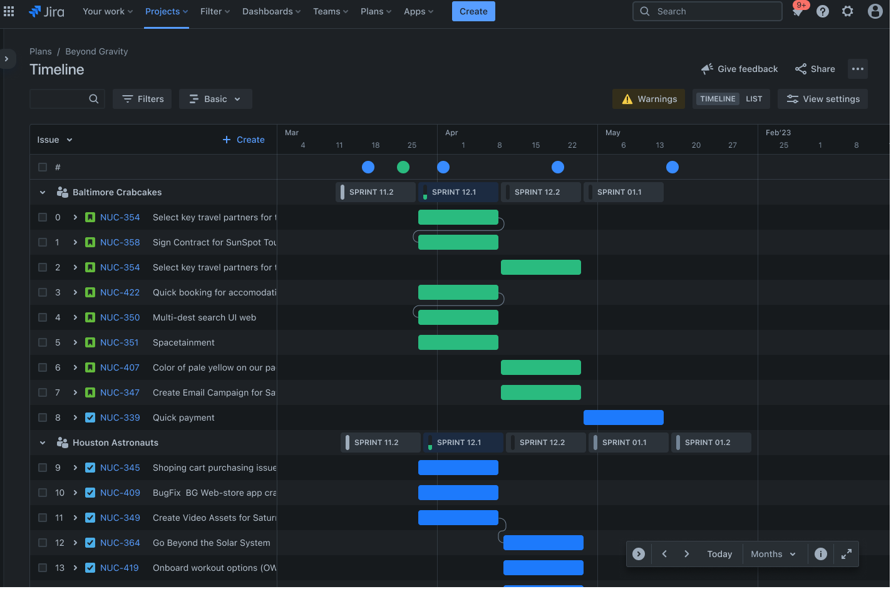
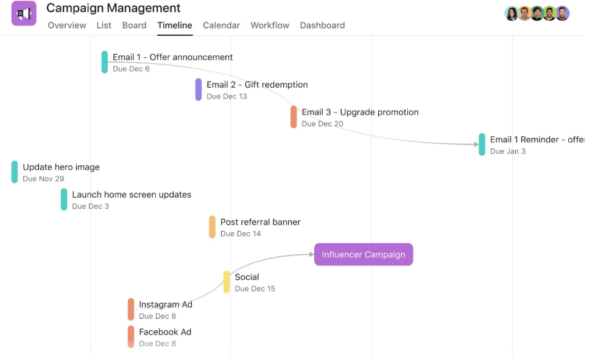
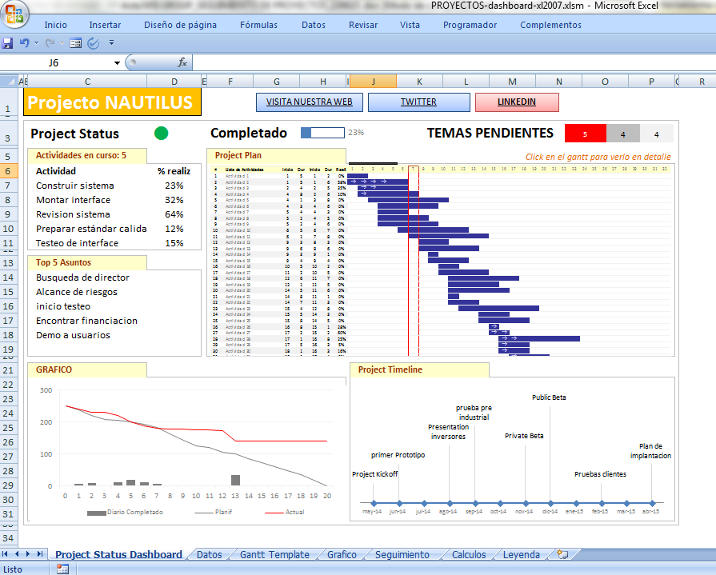
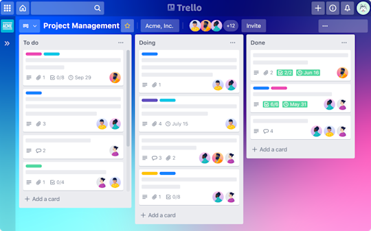

---

title: 6.- Panificació
layout: default
parent: Projecte Final de Cicle
nav_order: 60
has_children: true

---

# Planificació del Projecte

## Introducció

La planificació de projectes ofereix una visió clara i actualitzada de l’estat del projecte, amb informació sobre tasques, assignacions, dependències i fites. Aquesta informació es transmet de manera visual, utilitzant elements senzills i fàcils d’entendre a primera vista.

**Definir tasques**: Cal dividir els grans blocs de treball en tasques més xicotetes que siguen fàcils de planificar. També és important identificar les dependències entre tasques, ja que ajudaran a establir una seqüència d’execució coherent. Agrupar tasques similars en fites facilita l’organització general i permet reestructurar-les més endavant si cal.

**Seqüenciar tasques**: Una vegada definides, cal establir l’ordre d’execució de les tasques. És fonamental tindre en compte les dependències i utilitzar ferramentes de planificació que permeten visualitzar el flux complet del projecte, des de l’inici fins a la seua finalització.

**Estimar la duració de les tasques**: Encara que pot resultar complicat calcular el temps necessari per a cada tasca, dividir el treball en unitats més menudes fa que l’estimació siga més precisa i manejable.

Algunes de les tècniques i/o ferramentes útils per a la planificació de projectes són:

- Diagrames de Gantt  
- Llistes de tasques  
- Trello  
- Fulls de càlcul  
- Jira  
- ...

---

### Exemples:

  
  
  
  
  
  

## Guia Planificació del Projecte

El següent document és una guia de planificació del projecte. En ell es detallen els passos a seguir per a la correcta planificació del projecte, així com les ferramentes i tècniques que es poden utilitzar.

[Guia Planificació](Planificacio/guiaPlanificacioProjecte.html)

<iframe src="Planificacio/guiaPlanificacioProjecte.html" width="100%" height="600px" style="border:1px solid #ccc;"></iframe>

  <iframe src="demo/pagina.html" width="100%" height="1000px" style="border: none;"></iframe>

